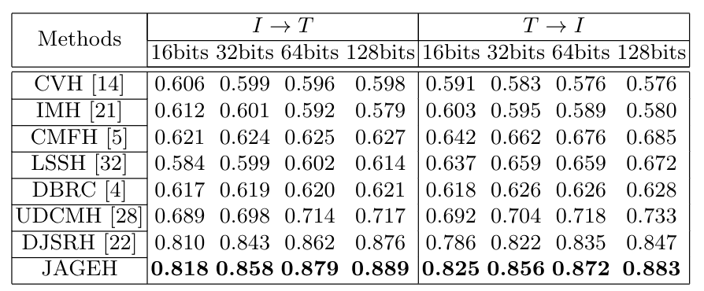

<h1 align = "center">Joint-modal Adaptive Graph-Enhancing Hashing for Unsupervised Cross-modal Retrieval</h1>

<h1 align = "center">Abstract</h1> 

Recent unsupervised deep cross-modal hashing retrieval methods have shown promising retrieval performance. However, existing methods  cannot sufficiently leverage semantic structures and correlations among instances to optimize semantic representation for unsupervised cross-modal retrieval. In this paper, we propose a novel unsupervised deep cross-modal hashing method termed Joint-modal Adaptive Graph-Enhancing Hashing for large-scale unsupervised cross-modal retrieval. First, we construct a joint-modal similarity matrix to fully and efficiently preserve neighborhood structures from different modality pre-trained features. Second, we adopt Graph Convolutional Network (GCN) to enhance the semantic representation and capture semantic structures for different modalities. In GCN, we proposed the adaptive adjacency matrix largely improve the model flexibility which is updated dynamically through learning. Extensive experiments demonstrate the superiority of JAGEH  on three public datasets NUS-WIDE, MIRFlickr and WIKI.

<h1 align = "center">Pileline</h1>

    

<small> Figure 1. The Pileline of JAGEH. </small>

<h1 align = "center">Result</h1>

    

<small> Figure 1. The Pileline of JAGEH. </small>

